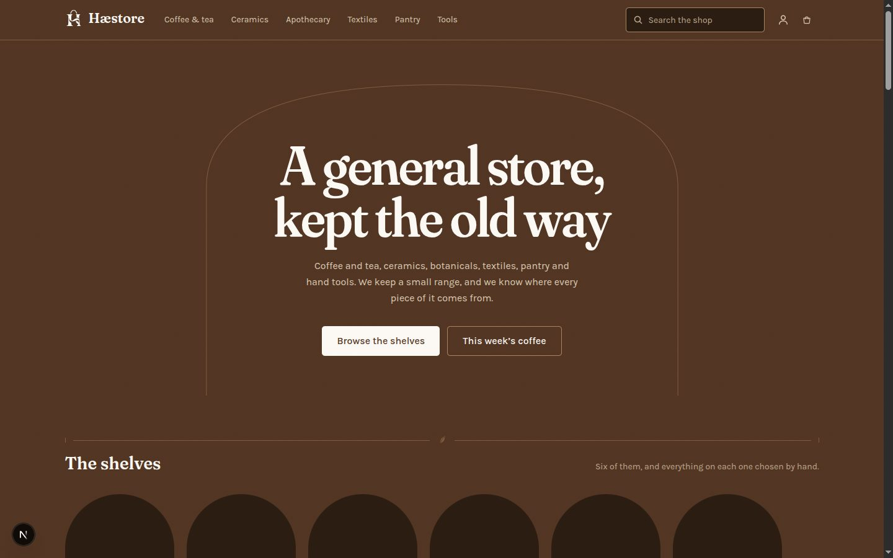
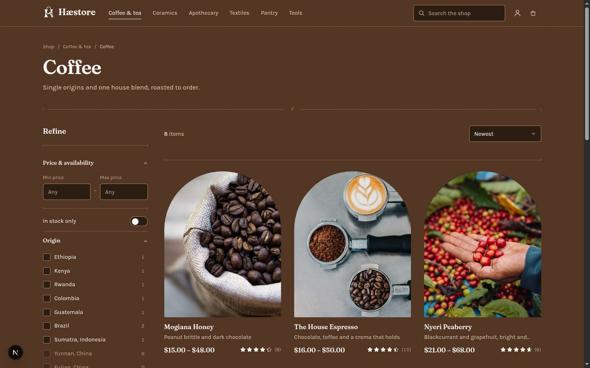
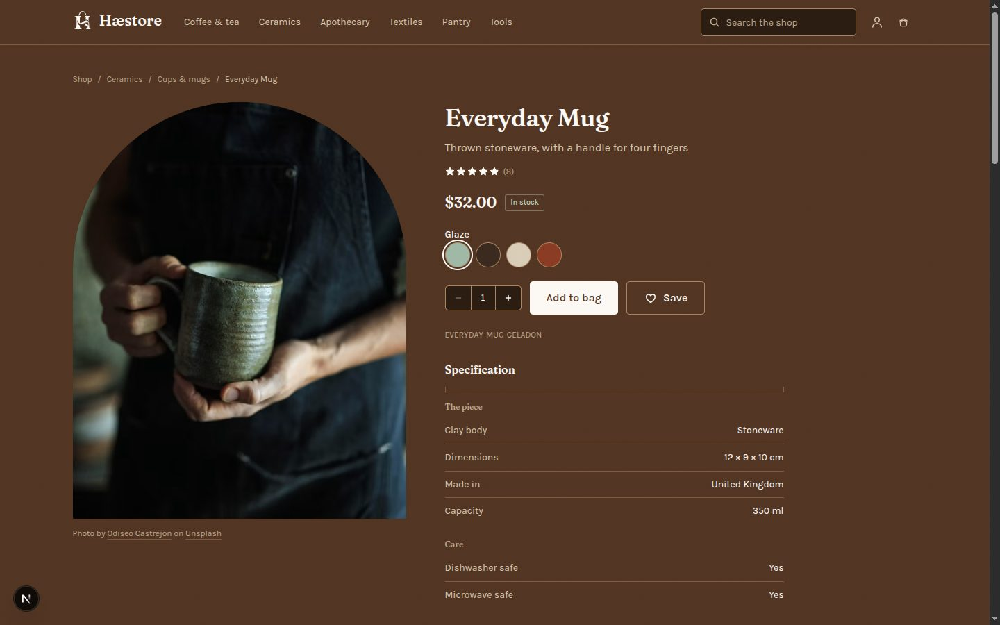
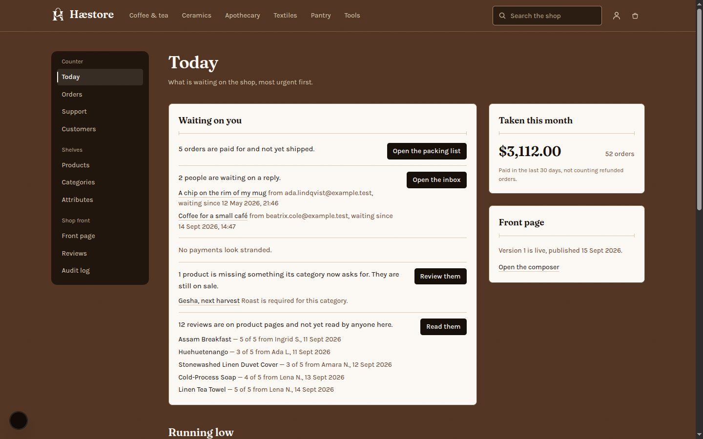

<div align="center">
  
  <h1>Hæstore</h1>
  <p><em>An artisanal general store — coffee, ceramics, botanicals, textiles, pantry, tools.</em></p>
</div>

---

Hæstore is a complete rebuild of *Adaptable Stores* (2022). This is the root repo: it
holds the documentation, the brand assets, and the local infrastructure. The two
applications live in their own repos alongside it.

| | Repo | Stack | Deploys to |
|---|---|---|---|
| Storefront + admin | [Haestore-FE](https://github.com/Elpis-alpha/Haestore-FE) | Next.js 15, React 19, Tailwind v4 | Cloudflare Workers |
| API | [Haestore-BE](https://github.com/Elpis-alpha/Haestore-BE) | Express 5, TypeScript, Mongoose 8 | Docker |

## What makes it *adaptable*

The old project was named **Adaptable Stores**, but nothing in it was adaptable.
Tracing `Item.ts` through its git history shows the product model starting with a
free-form `category` string and moving *away* from flexibility to a hardcoded
`enum: ["Cloth", "Shoe", "Cosmetic"]`. Five fields, no variants, no options, no stock.

Hæstore actually builds it:

- **Admins define the categories**, as a tree, not an enum.
- **Admins define the attributes** — name, type, unit, options, and whether each one
  is filterable or can act as a variant axis. Coffee gets roast, origin, process,
  grind and weight; ceramics gets glaze, dimensions and dishwasher-safe; apothecary
  gets volume, scent and skin type.
- **Products carry values** validated against whatever their category declares,
  inherited down the tree.
- **Variants are generated** from the axes a product actually uses — not every axis
  its category permits, so a single-origin sold only as whole bean never grows a
  phantom "ground" variant.
- **The storefront filter UI is generated from those definitions.** Define an
  attribute, mark it filterable, and a new facet appears in the shop with correct
  counts. Nothing is hardcoded, and an end-to-end test asserts exactly that.
- **Admins compose the storefront itself** from ordered, versioned blocks.

## What it looks like

| | |
|---|---|
|  |  |
|  |  |

Taken from the seeded shop. The rest — the attribute builder, the product form's photographs,
the composer, best-rated, a phone — are in [docs/screenshots](docs/screenshots/).

## Quick start

```bash
cp .env.example .env
npm install && npm run install:all
npm run up          # Mongo (replica set), Redis, Meilisearch
npm run probe       # 15 assertions about the platform, not about our code
npm --prefix back-end run seed
npm run dev
```

Storefront at <http://localhost:3000> and API at <http://localhost:5000>. There are no
passwords: sign-in codes are printed by the API with the default `console` mail driver,
and also readable at `/api/dev/outbox` outside production. There is no local SMTP server
to check — see [ADR-007](docs/decisions/ADR-007-gmail-api-only-no-smtp.md).

Full setup, ports and troubleshooting: **[docs/LOCAL-DEV.md](docs/LOCAL-DEV.md)**.

## Documentation

| | |
|---|---|
| [ARCHITECTURE](docs/ARCHITECTURE.md) | How the three repos, four datastores and two request paths fit together |
| [DATA-MODEL](docs/DATA-MODEL.md) | Collections, indexes, and how money and stock are represented |
| [ADAPTABLE-CATALOG](docs/ADAPTABLE-CATALOG.md) | Categories, attributes, variants, and generated facets |
| [SEARCH](docs/SEARCH.md) | Meilisearch as the read model, and how it stays in sync |
| [FRONTEND](docs/FRONTEND.md) | The storefront read path: URL state, the generated panel, view transitions |
| [AUTH](docs/AUTH.md) | Passwordless OTP and opaque Redis sessions |
| [CART](docs/CART.md) | Guest identity, re-pricing, and the sign-in merge |
| [CHECKOUT](docs/CHECKOUT.md) | Order state machine, Stripe, PayPal, idempotency |
| [PAYMENTS](docs/PAYMENTS.md) | The five PayPal checks, Stripe's signature, and the 2022 defect they repair |
| [ADMIN](docs/ADMIN.md) | The console: one gate, step-up, orders, the attribute builder, the storefront composer |
| [REVIEWS-AND-SUPPORT](docs/REVIEWS-AND-SUPPORT.md) | Verified-purchase reviews, moderation after publishing, and support conversations |
| [ACCESSIBILITY](docs/ACCESSIBILITY.md) | The Phase 9 audit: what was measured, what it found, and what was fixed |
| [DESIGN-SYSTEM](docs/DESIGN-SYSTEM.md) | Palette, type, the arch and leaf motifs, motion |
| [SEEDING](docs/SEEDING.md) | The demo shop: what the seed builds, how it writes, and the Unsplash rules it keeps |
| [DEPLOYMENT](docs/DEPLOYMENT.md) | Cloudflare Workers and the API container *(Phase 11)* |
| [decisions/](docs/decisions/) | ADRs — the contested forks and why they went the way they did |
| [PROGRESS](docs/PROGRESS.md) | Phase-by-phase build state |
| [MIGRATION](docs/MIGRATION-FROM-ADAPTABLE-STORES.md) | What changed from 2022, and why |

## Credits

Product photography from [Unsplash](https://unsplash.com), served from Unsplash's own CDN as
its guidelines require, with each photographer credited beside their photograph on the product
page ([ADR-015](docs/decisions/ADR-015-unsplash-photographs-are-hotlinked.md)). The
photographs chosen, and their credits, are in `back-end/src/seed/photos.lock.json`.
